# 🏗️ RentalHub — Complete System Architecture

**Date:** 2026-05-21 | **Model:** Hybrid P2P Marketplace (Vendors + Individuals)

> [!NOTE]
> This is the **full system blueprint** — not just software architecture, but how the entire business machine works: every person, every process, every decision point, every data flow. From the moment a user opens the app to the moment money hits a lender's bank account.

---

## Part 1: System Entities — Who & What Exists in This System

Every person, system, and concept that participates in the RentalHub ecosystem:

### 👤 ACTORS (People)

| # | Entity | Definition | Role in System | Trust Requirement |
|---|---|---|---|---|
| 1 | **Renter** | Any individual who wants to temporarily use an item they don't own. They search, book, pay, use, and return items. | Demand side. Pays money. Bears usage responsibility. | Phone OTP (minimum). KYC for items >₹5,000. |
| 2 | **Individual Lender** | Any person who lists their personal belongings for others to rent. They are NOT a registered business. | Supply side (long-tail). Earns money from idle assets. | Phone OTP + Aadhaar/DigiLocker KYC. Bank account verified. |
| 3 | **Vendor (Business Lender)** | A registered business (sole prop, LLP, or Pvt Ltd) that lists professional inventory for rent. May have GST, trade license. | Supply side (anchor). Professional-grade, reliable supply. | GST verification + PAN + Bank + Trade license. Full business KYC. |
| 4 | **Delivery Agent** | Third-party logistics person (via Dunzo/Porter API) who physically transports items between lender and renter. | Logistics layer. Moves atoms, not bits. | Managed by Dunzo/Porter. Platform doesn't directly employ. |
| 5 | **Platform Admin** | Internal team member who manages operations: vendor approvals, dispute escalations, content moderation, fraud review. | God-mode operator. Sees everything, can override anything. | Employee with role-based access (RBAC). |
| 6 | **Support Agent** | Human (or AI) that handles renter/lender issues: booking problems, refund requests, damage disputes. | Trust repair. The human safety net when systems fail. | Trained employee or AI with escalation paths. |

### 🖥️ SYSTEMS (Software & Services)

| # | Entity | Definition | What It Does |
|---|---|---|---|
| 7 | **Platform Core** | The central application (web + PWA) that connects all actors. Built on Next.js + Supabase. | Hosts all business logic: listings, search, bookings, payments, reviews, trust scores. |
| 8 | **Payment Processor** | Razorpay (primary) — handles money movement between renter, platform, and lender. | Collects payments, holds escrow via Razorpay Route, processes refunds, settles vendor payouts. |
| 9 | **Identity Verifier** | DigiLocker API + phone OTP — verifies that actors are who they claim to be. | KYC: pulls Aadhaar name, verifies phone, confirms identity for trust tier assignment. |
| 10 | **Logistics Orchestrator** | Dunzo/Porter API integration — coordinates physical item movement. | Dispatches delivery agents, provides tracking, calculates delivery fees and ETAs. |
| 11 | **AI Engine** | GPT-4o-mini / Claude API — powers intelligent features. | Natural language search, listing optimization, damage photo comparison, support chatbot, fraud detection signals. |
| 12 | **Notification System** | WhatsApp Business API (Wati/AiSensy) + FCM push + email (Resend). | Sends booking confirmations, payment receipts, reminders, delivery updates to all actors. |

### 📦 OBJECTS (Things in the System)

| # | Entity | Definition | Key Attributes |
|---|---|---|---|
| 13 | **Listing** | A single item available for rent, created by a Lender (individual or vendor). | Title, description, photos, daily/weekly price, security deposit, category, location, availability status, condition grade. |
| 14 | **Booking** | A confirmed rental transaction between one Renter and one Listing for a specific date range. | Start date, end date, total price, delivery method, payment status, booking state (see state machine). |
| 15 | **Transaction** | A financial record of money movement: payment, refund, payout, fee, or penalty. | Amount, type, from (renter/platform), to (lender/platform), status, timestamp. |
| 16 | **Review** | A two-way rating + text feedback left after a completed booking. Both renter and lender review each other. | Rating (1-5), text, photos, hidden until both submit, linked to booking. |
| 17 | **Trust Score** | A composite numerical score (0-100) assigned to every actor based on their behavior history. | Calculated from: KYC level + response rate + completion rate + review average + dispute history. |
| 18 | **Dispute** | A formal complaint raised by renter OR lender about a booking issue (damage, non-delivery, quality mismatch, etc.). | Type, evidence (photos/chat), status, resolution, assigned reviewer. |
| 19 | **Protection Plan** | An optional per-booking fee (5-8% of rental value) that provides a damage/loss coverage pool. NOT insurance. | Coverage limit, claim eligibility, exclusions. Legally a service fee, not IRDAI-regulated insurance. |

---

## Part 2: How the Complete System Works — End to End

### The Master Flow (Bird's Eye View)

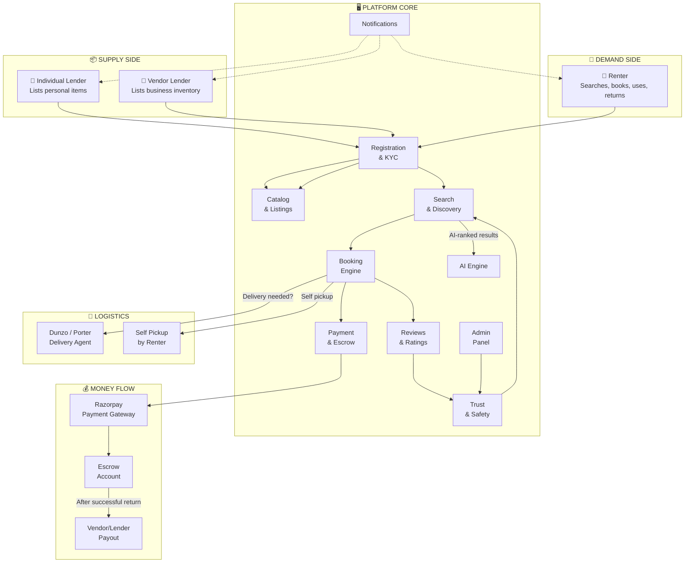

---

## Part 3: The 8 Core Flows (Detailed)

### FLOW 1: Registration & Identity Verification

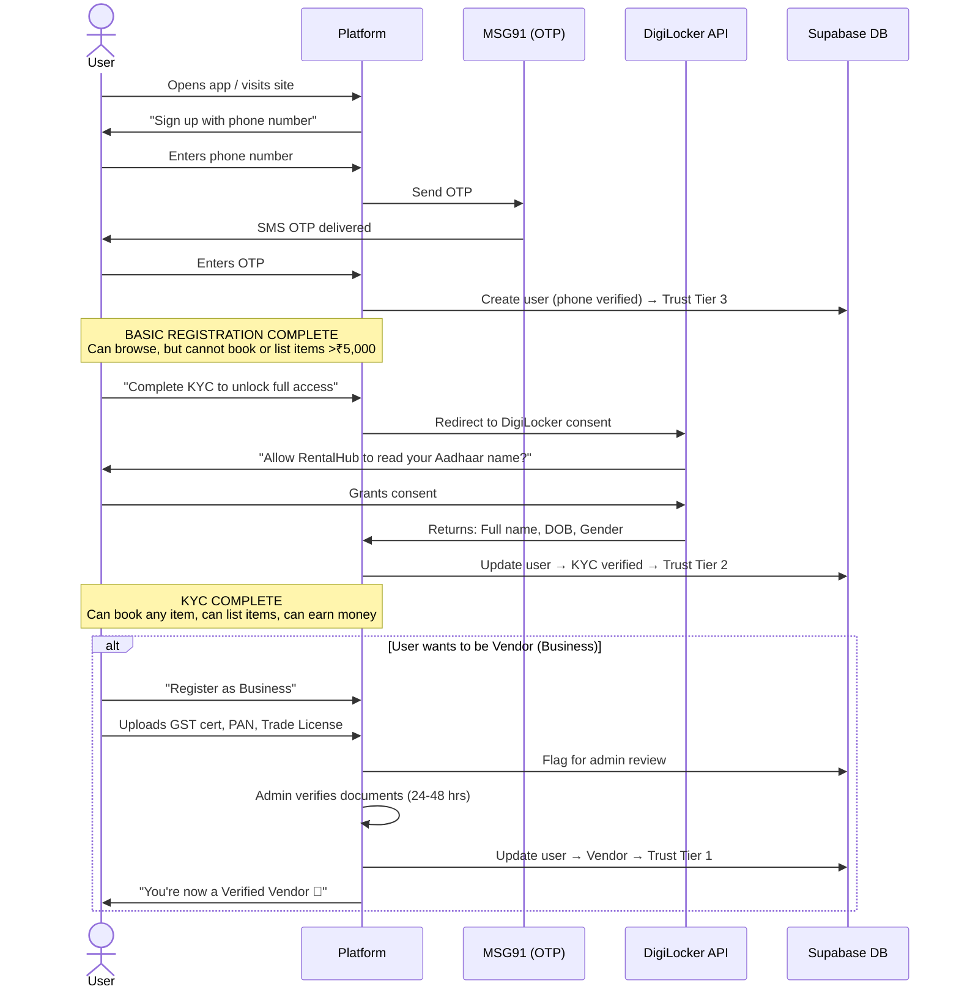

**Entity states after registration:**

| Tier | Who | Can Browse | Can Rent | Can List | Max Item Value | Badge |
|---|---|---|---|---|---|---|
| Tier 3 (Basic) | Phone-only user | ✅ | ❌ | ❌ | — | None |
| Tier 2 (Verified Individual) | KYC-complete person | ✅ | ✅ | ✅ | ₹50,000 | ✅ Verified |
| Tier 1 (Verified Vendor) | Business-verified entity | ✅ | ✅ | ✅ (incl. vehicles) | Unlimited | 🏪 Verified Business |

---

### FLOW 2: Listing an Item

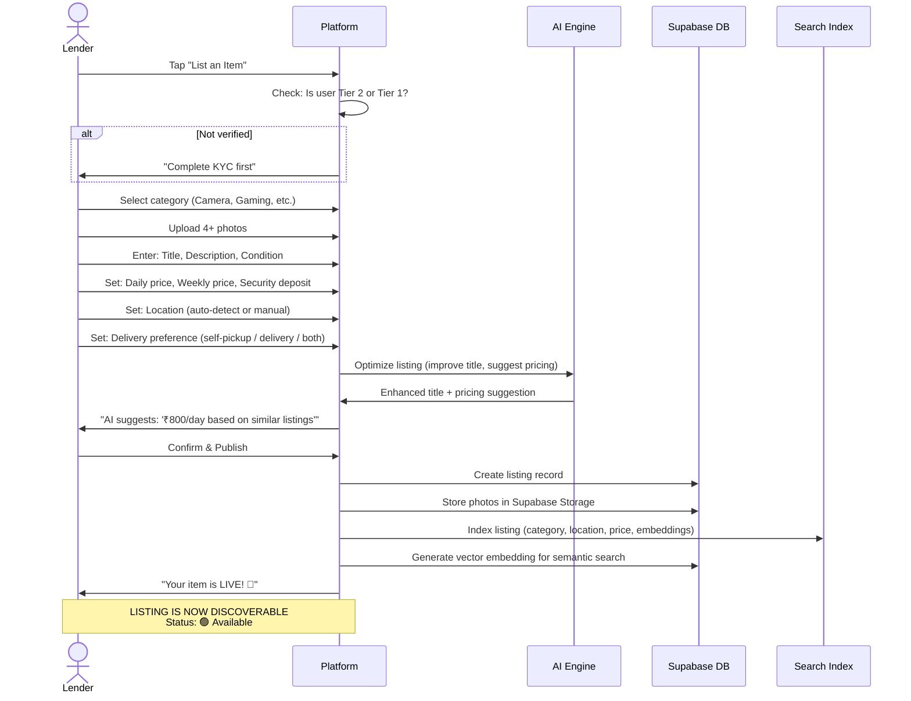

**Listing entity — full attribute map:**

```
LISTING {
  id:                 UUID (primary key)
  lender_id:          UUID (FK → users)
  lender_type:        ENUM ['individual', 'vendor']
  
  // Item details
  title:              TEXT (max 100 chars)
  description:        TEXT (max 2000 chars)
  category:           ENUM ['cameras', 'gaming', 'musical_instruments', 
                            'camping', 'electronics', 'fashion', 'tools',
                            'party_supplies', 'furniture', 'sports', 
                            'books', 'vehicles', 'other']
  subcategory:        TEXT
  brand:              TEXT (optional)
  condition:          ENUM ['like_new', 'good', 'fair', 'worn']
  item_value:         INTEGER (estimated replacement value in ₹)
  
  // Pricing
  price_daily:        INTEGER (₹)
  price_weekly:       INTEGER (₹, optional, usually discounted)
  price_monthly:      INTEGER (₹, optional, usually heavily discounted)
  security_deposit:   INTEGER (₹, max 50% of item_value)
  minimum_rental_days: INTEGER (default: 1)
  
  // Location & logistics
  location_lat:       FLOAT
  location_lng:       FLOAT
  location_area:      TEXT ('Kothrud, Pune')
  location_city:      TEXT ('Pune')
  delivery_options:   ENUM[] ['self_pickup', 'platform_delivery']
  
  // Media
  photos:             TEXT[] (URLs, minimum 4)
  
  // Status & availability
  status:             ENUM ['available', 'unavailable', 'rented', 
                            'under_review', 'suspended', 'deleted']
  availability_calendar: JSONB (blocked date ranges)
  
  // Trust & quality
  total_rentals:      INTEGER (counter)
  avg_rating:         FLOAT (1.0-5.0)
  response_rate:      FLOAT (0-100%)
  
  // Search
  embedding:          VECTOR(1536) (for semantic search via pgvector)
  
  // Timestamps
  created_at:         TIMESTAMP
  updated_at:         TIMESTAMP
  last_active_at:     TIMESTAMP (last time lender confirmed availability)
}
```

---

### FLOW 3: Discovery & Search

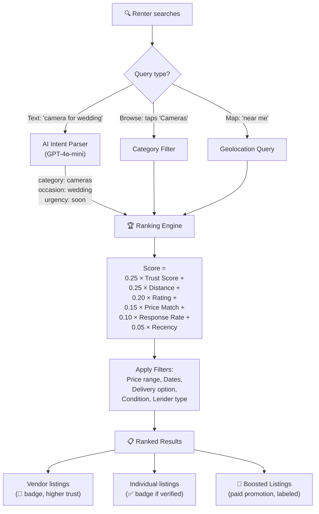

**Search ranking formula:**

```
SEARCH_SCORE = (
    0.25 × normalized_trust_score    +   // Lender's overall trust (0-1)
    0.25 × distance_score            +   // 1.0 = same neighborhood, 0.0 = 20km+
    0.20 × avg_rating_score          +   // 5.0→1.0, 1.0→0.0
    0.15 × price_relevance           +   // How close to searcher's budget
    0.10 × response_rate             +   // % of inquiries responded in <6hrs
    0.05 × recency_score                 // Last active / last updated
)

// BOOSTED LISTINGS: add flat +0.15 bonus (capped, labeled "Promoted")
// SOCIAL PROXIMITY: if lender is in renter's contact graph → +0.10 bonus
// NEW LISTER BOOST: first 30 days → +0.05 bonus (helps cold-start)
```

---

### FLOW 4: Booking & Reservation

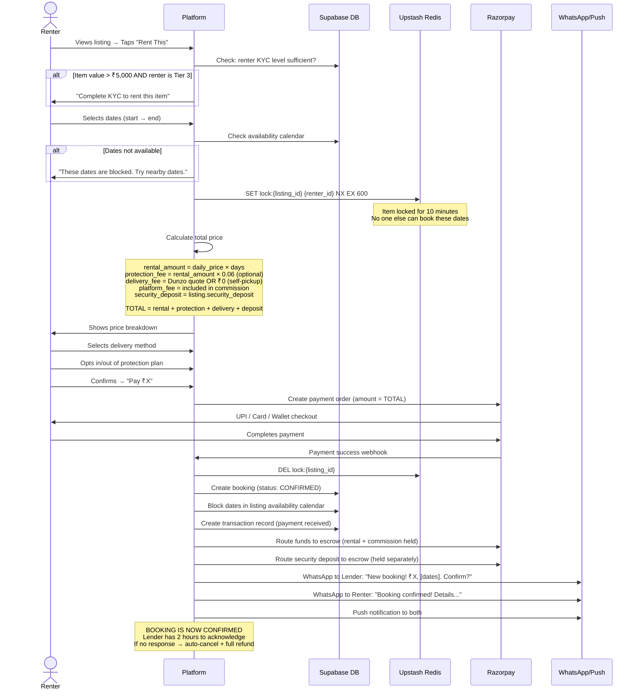

---

### FLOW 5: Payment & Escrow — Money Movement

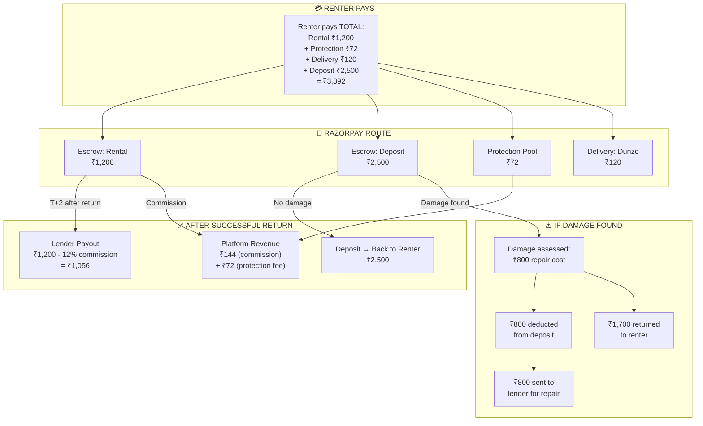

**Money flow rules:**

| Event | Rental Amount | Deposit | Protection Fee | Action |
|---|---|---|---|---|
| Booking confirmed | → Escrow | → Escrow | → Platform pool | All held by Razorpay Route |
| Lender doesn't acknowledge (2hrs) | → Refund to renter | → Refund to renter | → Refund to renter | Auto-cancel |
| Renter cancels (>24hrs before) | → 90% refund | → Full refund | → Full refund | 10% cancellation fee |
| Renter cancels (<24hrs before) | → 50% refund | → Full refund | → No refund | 50% kept for lender |
| Successful return, no damage | → Lender (minus commission) T+2 | → Renter (instant) | → Platform keeps | Normal settlement |
| Damage found | → Lender (minus commission) T+2 | → Deducted for repair → lender | → Used if deposit insufficient | Dispute may follow |
| Item not returned (theft) | → Lender | → Lender (full deposit) | → Lender (from pool) | Police report + blacklist renter |

---

### FLOW 6: Delivery / Pickup

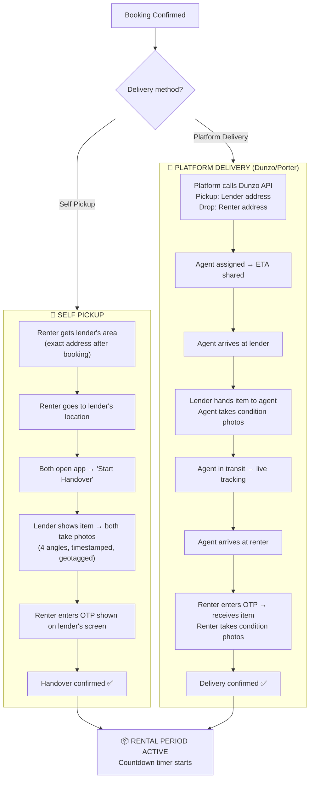

**Photo evidence protocol (non-negotiable for trust):**

```
HANDOVER PHOTOS (required at every handover point):
  
  1. FRONT VIEW      — full item, straight on
  2. BACK VIEW       — full item, opposite side
  3. DETAIL VIEW     — any existing scratches/wear (close-up)
  4. SERIAL/ID VIEW  — serial number or unique identifier visible

  Metadata captured automatically:
  - Timestamp (from device, verified against server)
  - GPS coordinates (proves location)
  - Device ID (prevents photo spoofing)
  - Hash (immutable record)
  
  Stored in: Supabase Storage (write-once, read-many)
  Retention: 90 days after booking completion
```

---

### FLOW 7: Return & Inspection

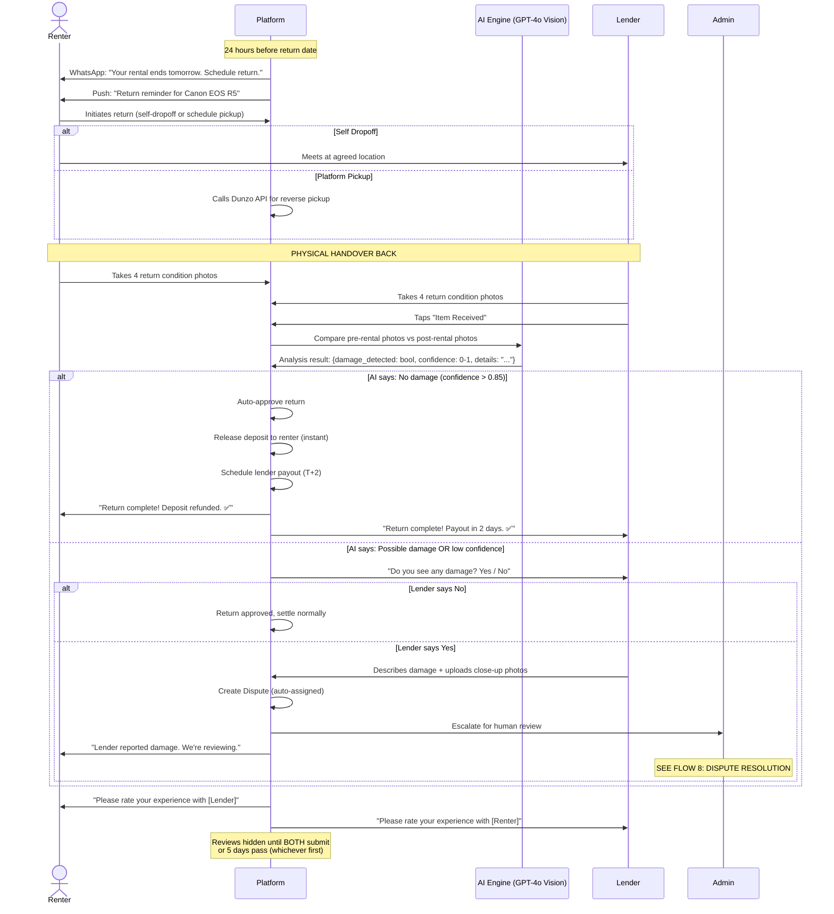

---

### FLOW 8: Dispute Resolution

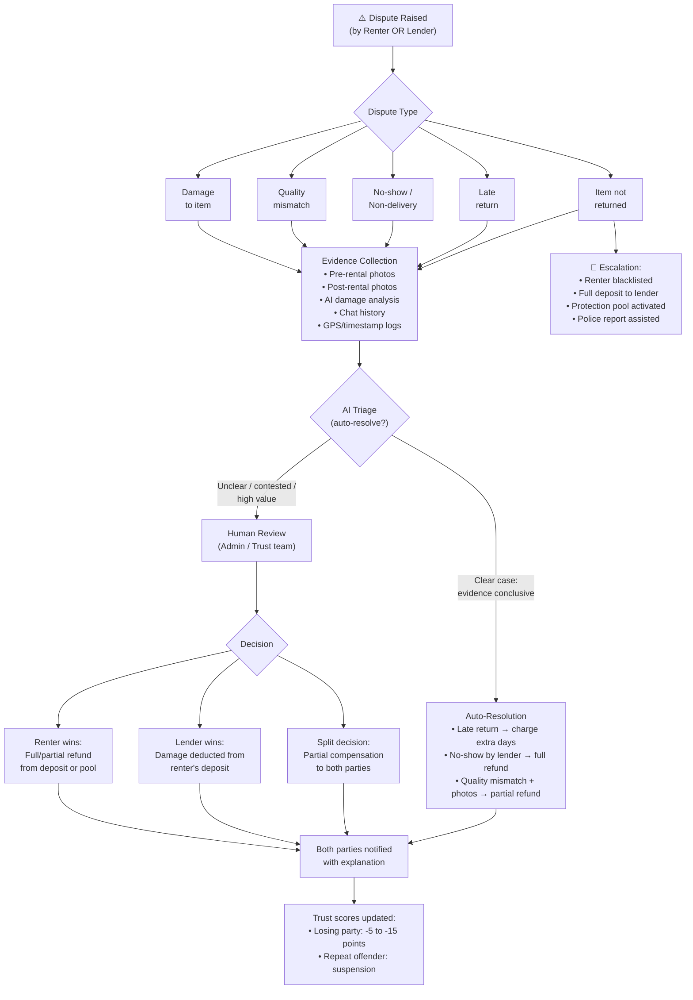

**Dispute SLA:**

| Priority | Resolution Target | Who Handles |
|---|---|---|
| Theft / Safety | 4 hours | Founder (Month 1-6), then Trust & Safety lead |
| Damage claim >₹5,000 | 24 hours | Human reviewer |
| Damage claim <₹5,000 | 12 hours | AI auto-resolve if evidence clear, else human |
| Late return | Instant | Auto-charge extra days from deposit |
| Quality mismatch | 24 hours | Human reviewer with photo comparison |
| No-show by lender | Instant | Auto-refund + lender penalty |

---

## Part 4: Booking State Machine

Every booking moves through exactly these states:

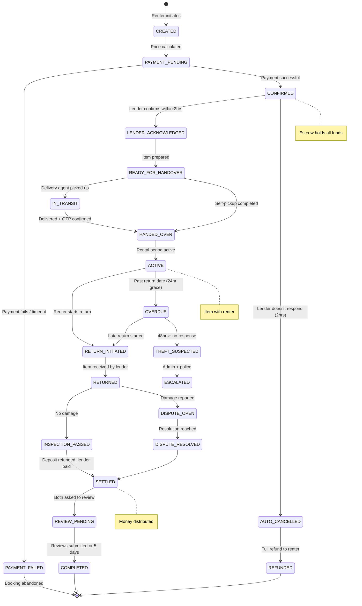

---

## Part 5: Trust Score System

```
TRUST_SCORE (0-100) = weighted composite

COMPONENTS:
┌──────────────────────────────────────────────────────────────┐
│                                                              │
│  KYC_LEVEL (0-25 points)                                     │
│  ├─ Phone only:           5 pts                              │
│  ├─ + Aadhaar verified:  15 pts                              │
│  ├─ + Bank verified:     20 pts                              │
│  └─ + GST/Business:      25 pts                              │
│                                                              │
│  TRANSACTION_HISTORY (0-30 points)                            │
│  ├─ 0 completed:          0 pts                              │
│  ├─ 1-5 completed:       10 pts                              │
│  ├─ 6-20 completed:      20 pts                              │
│  └─ 21+ completed:       30 pts                              │
│                                                              │
│  REVIEW_SCORE (0-20 points)                                   │
│  ├─ avg_rating × 4 (so 5.0 → 20, 4.0 → 16, etc.)           │
│  └─ Minimum 3 reviews to activate                            │
│                                                              │
│  RESPONSE_RELIABILITY (0-15 points)                           │
│  ├─ Response rate × 10 (so 100% → 10)                       │
│  ├─ + Completion rate × 5 (bookings honored / total)         │
│  └─ Penalized: -3 per cancellation by lender                │
│                                                              │
│  DISPUTE_HISTORY (0 to -10 penalty)                           │
│  ├─ 0 disputes lost:      0 pts                              │
│  ├─ 1 dispute lost:      -3 pts                              │
│  ├─ 2 disputes lost:     -7 pts                              │
│  └─ 3+ disputes lost:   -10 pts + REVIEW BY ADMIN            │
│                                                              │
│  SOCIAL_PROOF (0-10 bonus, optional)                          │
│  ├─ Google/FB connected:  +3 pts                             │
│  ├─ Profile photo:        +2 pts                             │
│  ├─ Bio completed:        +2 pts                             │
│  └─ Referred by trusted user: +3 pts                         │
│                                                              │
│  FINAL SCORE = KYC + HISTORY + REVIEWS + RELIABILITY         │
│                + DISPUTES + SOCIAL                            │
│  Capped at 0 (floor) and 100 (ceiling)                       │
│                                                              │
│  THRESHOLDS:                                                  │
│  ├─ <20:  "New" (limited visibility, lower booking limits)   │
│  ├─ 20-49: "Building Trust" (normal access)                  │
│  ├─ 50-79: "Trusted" (priority in search, higher limits)    │
│  └─ 80+:  "Top Rated" (badge, featured placement)           │
│                                                              │
└──────────────────────────────────────────────────────────────┘
```

---

## Part 6: Technical Architecture

```
┌────────────────────────────────────────────────────────────────────┐
│                        CLIENTS                                      │
│                                                                      │
│  📱 PWA (Next.js 14)        📱 Native App (Phase 2, Flutter)        │
│  └─ Renter views            └─ Same features, native push           │
│  └─ Lender views                                                     │
│  └─ Admin dashboard                                                  │
│                                                                      │
│  All communicate via REST API + Supabase Realtime (WebSocket)        │
├────────────────────────────────────────────────────────────────────┤
│                        EDGE / CDN                                    │
│                                                                      │
│  Vercel Edge Network         Cloudflare R2 + CDN                     │
│  └─ SSR / SSG pages          └─ Photos, documents                    │
│  └─ API routes               └─ Global edge delivery                 │
│  └─ ISR for SEO pages                                                │
├────────────────────────────────────────────────────────────────────┤
│                        APPLICATION LAYER                             │
│                                                                      │
│  ┌─────────────┐ ┌─────────────┐ ┌─────────────┐ ┌──────────────┐  │
│  │ Auth &      │ │ Listings &  │ │ Booking     │ │ Search &     │  │
│  │ Users       │ │ Catalog     │ │ Engine      │ │ Discovery    │  │
│  │             │ │             │ │             │ │              │  │
│  │ • Register  │ │ • CRUD      │ │ • Reserve   │ │ • Text search│  │
│  │ • KYC       │ │ • Photos    │ │ • Lock      │ │ • AI intent  │  │
│  │ • Trust     │ │ • Pricing   │ │ • Confirm   │ │ • Geo filter │  │
│  │   Score     │ │ • Avail.    │ │ • States    │ │ • Vector     │  │
│  │ • Profiles  │ │ • Toggle    │ │ • Cancel    │ │   similarity │  │
│  └──────┬──────┘ └──────┬──────┘ └──────┬──────┘ └──────┬───────┘  │
│         │               │               │               │           │
│  ┌──────┴──────┐ ┌──────┴──────┐ ┌──────┴──────┐ ┌──────┴───────┐  │
│  │ Payment &   │ │ Reviews &   │ │ Disputes &  │ │ Notification │  │
│  │ Escrow      │ │ Ratings     │ │ Safety      │ │ Engine       │  │
│  │             │ │             │ │             │ │              │  │
│  │ • Razorpay  │ │ • Two-way   │ │ • Create    │ │ • WhatsApp   │  │
│  │ • Route     │ │ • Hidden    │ │ • AI triage │ │ • Push (FCM) │  │
│  │ • Escrow    │ │   reveal    │ │ • Human     │ │ • Email      │  │
│  │ • Payouts   │ │ • Trust     │ │   review    │ │ • In-app     │  │
│  │ • Refunds   │ │   impact    │ │ • Resolve   │ │ • SMS (OTP)  │  │
│  └──────┬──────┘ └──────┬──────┘ └──────┬──────┘ └──────┬───────┘  │
│         └───────────────┴───────────────┴───────────────┘           │
├────────────────────────────────────────────────────────────────────┤
│                        DATA LAYER                                    │
│                                                                      │
│  ┌──────────────────┐  ┌────────────┐  ┌─────────────────────────┐  │
│  │ Supabase         │  │ Upstash    │  │ External APIs           │  │
│  │ (PostgreSQL)     │  │ Redis      │  │                         │  │
│  │                  │  │            │  │ • Razorpay (payments)   │  │
│  │ • All tables     │  │ • Booking  │  │ • DigiLocker (KYC)     │  │
│  │ • Row Level      │  │   locks    │  │ • Dunzo/Porter (deliv) │  │
│  │   Security       │  │ • Session  │  │ • OpenAI (AI search)   │  │
│  │ • pgvector       │  │   cache    │  │ • Wati (WhatsApp)      │  │
│  │   (embeddings)   │  │ • Rate     │  │ • MSG91 (SMS/OTP)      │  │
│  │ • Realtime       │  │   limiting │  │ • Resend (email)       │  │
│  │   (WebSocket)    │  │            │  │ • Google Maps (geo)    │  │
│  │ • Auth           │  │            │  │ • Sentry (errors)      │  │
│  │ • Storage        │  │            │  │                         │  │
│  │   (photos/docs)  │  │            │  │                         │  │
│  └──────────────────┘  └────────────┘  └─────────────────────────┘  │
│                                                                      │
└────────────────────────────────────────────────────────────────────┘
```

---

## Part 7: Complete Data Model

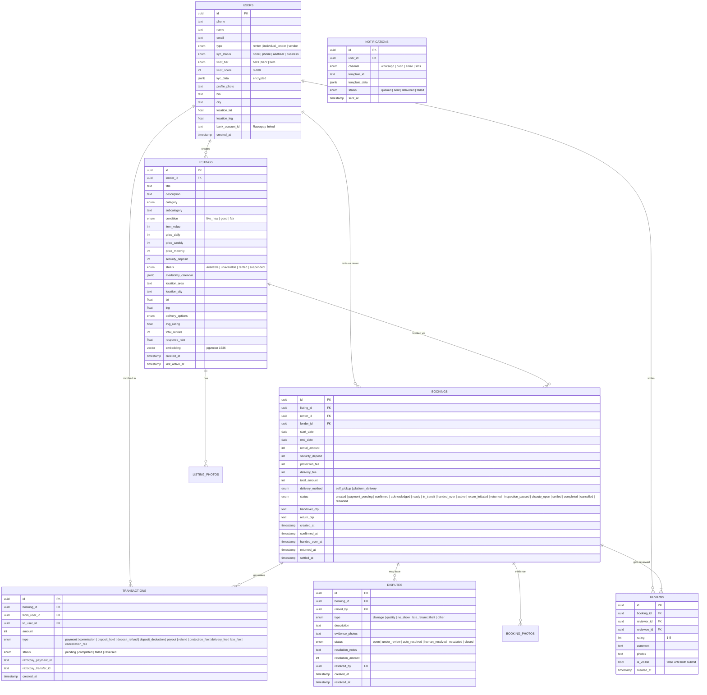

---

## Part 8: Notification Matrix — Who Gets What, When

| Event | Renter | Lender | Channel | Timing |
|---|---|---|---|---|
| Booking created | "Booking confirmed! ₹X paid." | "New booking! [Item] for [dates]. Reply YES." | WhatsApp + Push | Instant |
| Lender acknowledges | "Lender confirmed! Preparing item." | "Great! Prepare item for [date]." | Push | Instant |
| Lender doesn't respond (2hrs) | "Auto-cancelled. Full refund." | "You missed a booking. Response rate affected." | WhatsApp + Push | After 2hrs |
| Delivery dispatched | "Item on the way! Track here." | "Item picked up by delivery agent." | Push + WhatsApp | Instant |
| Handover complete | "Enjoy your rental! Return by [date]." | "Item delivered to renter." | Push | Instant |
| 24hrs before return | "Return reminder: [item] due tomorrow." | "Expect return tomorrow." | WhatsApp + Push | T-24hrs |
| Return completed | "Deposit refunded! Please rate." | "Item back! Payout in 2 days. Rate renter." | WhatsApp + Push | Instant |
| Damage dispute | "Lender reports damage. We're reviewing." | "We received your damage report. Reviewing." | WhatsApp | Instant |
| Dispute resolved | "Resolved: [outcome]. ₹X refunded/charged." | "Resolved: [outcome]. ₹X awarded." | WhatsApp + Email | On resolution |
| Payout processed | — | "₹X deposited to your bank account." | WhatsApp | T+2 days |
| New review received | "You got a review! ⭐ [X/5]" | "You got a review! ⭐ [X/5]" | Push | On reveal |
| Listing going stale | — | "Update your listing. Still available?" | WhatsApp | After 14 days idle |

---

## Part 9: Operational Playbook — The Human Side

### Daily Operations (City Ops Team)

```
MORNING (9:00 AM):
  □ Review overnight bookings — any lender non-responses?
  □ Check active disputes — any past SLA?
  □ Review new vendor applications (if any)
  □ Check listing quality — any spam/fake listings reported?

MIDDAY (1:00 PM):
  □ Follow up on pending deliveries
  □ Check return schedule for today
  □ Review AI-flagged listings (low quality, pricing anomalies)

EVENING (6:00 PM):
  □ Process vendor payouts (T+2 batch)
  □ Review day's dispute resolutions
  □ Update vendor/lender CRM notes
  □ Check trust score anomalies

WEEKLY:
  □ Vendor relationship calls (top 10 vendors)
  □ Review category performance (which categories getting traction)
  □ Analyze drop-off funnel (search → listing view → book → complete)
  □ Community engagement (respond to Reddit/social mentions)

MONTHLY:
  □ Vendor retention review (anyone churning?)
  □ Trust score calibration (are scores predictive of behavior?)
  □ Category expansion review (what are users searching for that we don't have?)
  □ Financial review (unit economics, CAC, LTV tracking)
```

---

## Part 10: Security Architecture

```
┌─────────────────────────────────────────────────────────┐
│                    SECURITY LAYERS                       │
├─────────────────────────────────────────────────────────┤
│                                                          │
│  LAYER 1: IDENTITY                                       │
│  ├─ Supabase Auth (JWT tokens, refresh rotation)         │
│  ├─ Phone OTP (MSG91) — proof of phone ownership         │
│  ├─ DigiLocker — proof of identity (Aadhaar-linked)      │
│  └─ Session management: 30-day refresh, 1-hour access    │
│                                                          │
│  LAYER 2: AUTHORIZATION                                  │
│  ├─ Row Level Security (RLS) in Supabase                 │
│  │   • Users can only read/update their own data         │
│  │   • Lenders can only modify their own listings        │
│  │   • Booking data visible only to involved parties     │
│  ├─ Role-Based Access Control (RBAC)                     │
│  │   • renter, lender, vendor, admin, super_admin        │
│  └─ API rate limiting (Upstash Redis)                    │
│     • 100 requests/minute per user                       │
│     • 10 booking attempts/hour per user                  │
│                                                          │
│  LAYER 3: DATA PROTECTION                                │
│  ├─ KYC data encrypted at rest (AES-256)                 │
│  ├─ PII (phone, Aadhaar) never exposed in API responses  │
│  ├─ Photos stored with write-once policy                 │
│  ├─ DPDPA compliance:                                    │
│  │   • Explicit consent at registration                  │
│  │   • Data deletion on account closure (within 30 days) │
│  │   • Minimum data collection principle                 │
│  └─ CERT-In: 6-hour breach notification SOP              │
│                                                          │
│  LAYER 4: PAYMENT SECURITY                               │
│  ├─ Razorpay handles PCI-DSS compliance                  │
│  ├─ No card data touches our servers                     │
│  ├─ Webhook signature verification on all callbacks      │
│  └─ Idempotency keys on all payment operations           │
│                                                          │
│  LAYER 5: FRAUD PREVENTION                               │
│  ├─ Velocity checks: max 3 bookings/day per user         │
│  ├─ New user limits: first 3 bookings capped at ₹5,000  │
│  ├─ Device fingerprinting (basic)                        │
│  ├─ GPS verification on photo uploads                    │
│  ├─ AI anomaly detection (unusual booking patterns)      │
│  └─ Manual review queue for high-value transactions      │
│                                                          │
└─────────────────────────────────────────────────────────┘
```

---

## Quick Reference: How Everything Connects

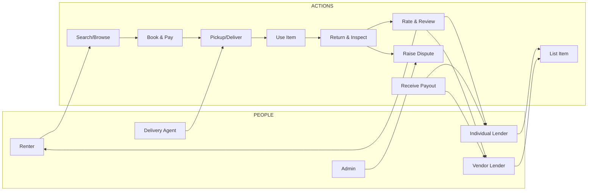

> [!TIP]
> **Print this document.** Every engineer, designer, ops person, and co-founder should have this as their reference. When someone asks "how does X work?" — the answer is in here.
